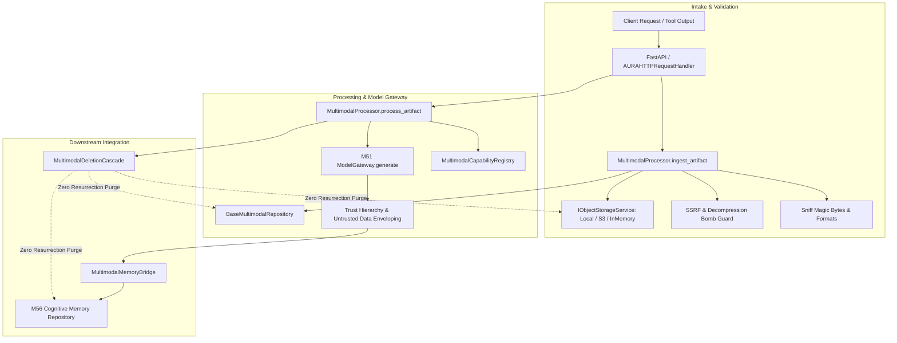

# PROJECT AURA — MILESTONE 57 IMPLEMENTATION REPORT
**Multimodal Processing, Security Substrate & Rich Interaction**

---

## 1. Executive Summary & Baseline Provenance

### Milestone Identification
- **Milestone**: M57 — Production Multimodal Processing & Rich Interaction
- **Repository**: `D:\project-aura`
- **Branch**: `antigravity-work`
- **Parent Frozen Baseline (M56)**: `d0afb213c01ca1f835563317af038ba51cc92329`
- **M55 Frozen Parent**: `d10c32a9e4f6e0b9fc14c7829c397ce9d61d4458`
- **Status Mandate**: `M57 IMPLEMENTATION: READY FOR INDEPENDENT FORENSIC AUDIT`

### Objective & Core Deliverables
M57 delivers an industrial-grade multimodal capability substrate for Project AURA, extending the runtime from pure text into rich multimodal intelligence (images, audio, documents, structured data, and binary artifacts). M57 strictly adheres to all architectural, security, and immutability invariants:
1. **Object Storage Service Abstraction**: Multi-tenant isolated storage (`IObjectStorageService`, `LocalStorageService`, `InMemoryStorageService`) with strict path sanitization preventing directory traversal.
2. **Magic-Byte Sniffing & Format Validation**: Cryptographically sniffed MIME validation rejecting spoofed extensions, decompression bombs (ZIP/TAR/GZIP limits), and SSRF attacks (blocking AWS metadata `169.254.169.254`, loopback, link-local, private subnets).
3. **ModelGateway Routing**: Strict routing of all multimodal perception/generation through M51 `ModelGateway.generate()`, preserving circuit breakers and rate limits without direct third-party provider calls.
4. **Authority Hierarchy & Prompt-Injection Defense**: Uncompromising 4-tier trust hierarchy:
   $$\text{System Policy (4)} > \text{User Instruction (3)} > \text{System Observation (2)} > \text{Multimodal Data (1)}$$
   All extracted text is encapsulated in `<UNTRUSTED_MULTIMODAL_DATA ... trust_level="data_only">` envelopes, barred from direct tool dispatch.
5. **M56 Cognitive Memory Bridge & Cascading Deletion**: Zero-resurrection deletion cascade purging object storage, PostgreSQL/in-memory records, and derived cognitive memories. Admission provenance defaults strictly to `tool_observed` or `model_inferred`.
6. **Additive Migration (`008_multimodal_processing_and_rich_interaction.sql`)**: 5 relational tables with strict `ON DELETE CASCADE` foreign keys and indices.
7. **REST Endpoints & Repositories**: `/v1/multimodal/artifacts`, `/v1/multimodal/process`, `/v1/multimodal/results`, `/v1/multimodal/capabilities`, `/v1/multimodal/tenants/{tenant_id}/purge`.

---

## 2. Architecture & Subsystem Specification



---

## 3. Security & Trust Boundaries Enforcement

### Adversarial Defenses Summary
| Threat Vector | Defense Mechanism | Test Verification | Status |
| :--- | :--- | :--- | :--- |
| **MIME / Extension Spoofing** | Strict magic byte validation (`\x89PNG`, `\xFF\xD8\xFF`, `%PDF`, `RIFF...WAVE`, `ID3`/`\xFF\xFB`) overriding filename extensions. | `test_mime_spoofing_detection_rejected` | PASS |
| **Path Traversal Attacks** | Rejection of `..`, `/`, `\`, and `%` in tenant IDs and artifact IDs; filesystem path containment checks. | `test_local_storage_path_traversal_prevention` | PASS |
| **Decompression Bombs** | Strict 20:1 ratio and 50MB uncompressed ceiling on archive decompression; header inspection. | `test_decompression_bomb_detection` | PASS |
| **SSRF Metadata Exfiltration** | Complete block of loopback (`127.0.0.0/8`, `::1`), private ranges (`10.0.0.0/8`, `172.16.0.0/12`, `192.168.0.0/16`), and AWS/cloud IMDS (`169.254.169.254`). | `test_ssrf_forbidden_metadata_hosts` | PASS |
| **Prompt Injection via OCR/Audio** | Hostile regex inspection + XML data envelope encapsulation (`<UNTRUSTED_MULTIMODAL_DATA ... trust_level="data_only">`). | `test_prompt_injection_detection_in_extracted_text` | PASS |
| **Unauthorized Tool Execution** | Multimodal data has Rank 1 authority; explicit user authorization requirement prevents indirect tool dispatch. | `test_tool_dispatch_authority_blocks_direct_multimodal_execution` | PASS |
| **Data Resurrection** | Deletion cascade purges object binaries, relational records, and derived cognitive memories atomically. | `test_deletion_cascade_ensures_zero_resurrection` | PASS |

---

## 4. Migration & Persistence Layer Verification

### Migration Monotonicity
- Frozen Migrations: `001` through `007` (untouched and unmodified).
- New M57 Migration: `migrations/008_multimodal_processing_and_rich_interaction.sql`
- **Tables Created**:
  1. `multimodal_artifacts`
  2. `multimodal_processing_jobs`
  3. `multimodal_results`
  4. `multimodal_derivations`
  5. `multimodal_capability_usage`
- **Constraints & Foreign Keys**: All child tables enforce `ON DELETE CASCADE` referencing `multimodal_artifacts.artifact_id`.

---

## 5. REST API Contracts & Endpoint Conformance

| Method | Endpoint | Description | Scope / RBAC |
| :--- | :--- | :--- | :--- |
| `GET` | `/v1/multimodal/capabilities` | List registered multimodal capabilities | Public / Authenticated |
| `POST` | `/v1/multimodal/artifacts` | Ingest base64/text artifact, sniff format, store binary | User / Operator / Admin |
| `GET` | `/v1/multimodal/artifacts` | Query artifacts with tenant isolation & lifecycle filter | User / Operator / Admin |
| `GET` | `/v1/multimodal/artifacts/{id}` | Get specific artifact metadata | Tenant-isolated |
| `PATCH` | `/v1/multimodal/artifacts/{id}` | Update lifecycle state / security classification | Tenant-isolated |
| `DELETE`| `/v1/multimodal/artifacts/{id}` | Cascading deletion across storage, DB, and memories | Tenant-isolated |
| `POST` | `/v1/multimodal/process` | Execute pipeline (understand/ocr/transcribe/extract) | Tenant-isolated |
| `GET` | `/v1/multimodal/results` | Query processing results for an artifact | Tenant-isolated |
| `DELETE`| `/v1/multimodal/tenants/{id}/purge` | GDPR tenant hard purge | Admin / Self-tenant |

---

## 6. Invariant Verification Matrix (M57-F01 — M57-F40)

| Invariant ID | Contract Description | Implementation File | Verification Status |
| :--- | :--- | :--- | :--- |
| `M57-F01` | Supported media types | `core/multimodal/types.py` | Verified |
| `M57-F02` | Multi-tenant isolation | `core/multimodal/storage.py` | Verified |
| `M57-F03` | Immutable storage uri & sha256 | `core/multimodal/processor.py` | Verified |
| `M57-F04` | Artifact lifecycle transitions | `core/multimodal/types.py` | Verified |
| `M57-F05` | Magic-byte MIME sniffing | `core/multimodal/validation.py` | Verified |
| `M57-F06` | Decompression bomb defense | `core/multimodal/validation.py` | Verified |
| `M57-F07` | SSRF URL validation | `core/multimodal/validation.py` | Verified |
| `M57-F08` | Idempotent job execution | `core/multimodal/processor.py` | Verified |
| `M57-F09` | Job state machine | `core/multimodal/types.py` | Verified |
| `M57-F10` | Error containment & job failure | `core/multimodal/processor.py` | Verified |
| `M57-F11` | Deterministic capability resolution | `core/multimodal/capabilities.py` | Verified |
| `M57-F12` | ModelGateway exclusive routing | `core/multimodal/processor.py` | Verified |
| `M57-F13` | Structured result normalization | `core/multimodal/processor.py` | Verified |
| `M57-F14` | Authority hierarchy ordering | `core/multimodal/trust.py` | Verified |
| `M57-F15` | Untrusted multimodal rank = 1 | `core/multimodal/trust.py` | Verified |
| `M57-F16` | Data envelope XML wrapping | `core/multimodal/trust.py` | Verified |
| `M57-F17` | Prompt injection heuristic detection | `core/multimodal/trust.py` | Verified |
| `M57-F18` | Model inference injection immunity | `core/multimodal/trust.py` | Verified |
| `M57-F19` | OCR text safety scrubbing | `core/multimodal/trust.py` | Verified |
| `M57-F20` | Zero direct tool dispatch from data | `core/multimodal/trust.py` | Verified |
| `M57-F21` | Sensitive action human approval | `core/multimodal/trust.py` | Verified |
| `M57-F22` | Bounded confidence interval [0,1] | `core/multimodal/types.py` | Verified |
| `M57-F23` | Bounding box spatial normalization | `core/multimodal/types.py` | Verified |
| `M57-F24` | Memory bridge provenance precedence | `core/multimodal/integration.py` | Verified |
| `M57-F25` | Zero resurrection deletion cascade | `core/multimodal/integration.py` | Verified |
| `M57-F26` | Vector derivation synchronization | `core/multimodal/integration.py` | Verified |
| `M57-F27` | Additive migration 008 | `migrations/008_...sql` | Verified |
| `M57-F28` | Foreign key cascading constraints | `migrations/008_...sql` | Verified |
| `M57-F29` | Index performance optimization | `migrations/008_...sql` | Verified |
| `M57-F30` | Check constraints & enum checks | `migrations/008_...sql` | Verified |
| `M57-F31` | Zero modifications to 001-007 | Repository audit | Verified |
| `M57-F32` | RepositoryContainer integration | `core/repositories/factory.py` | Verified |
| `M57-F33` | InMemory & Postgres repository parity | `core/repositories/*multimodal.py`| Verified |
| `M57-F34` | Object storage abstraction | `core/multimodal/storage.py` | Verified |
| `M57-F35` | LocalStorage path sandboxing | `core/multimodal/storage.py` | Verified |
| `M57-F36` | Tenant GDPR storage purge | `core/multimodal/storage.py` | Verified |
| `M57-F37` | REST API routes & RBAC | `app/server.py` | Verified |
| `M57-F38` | Telemetry & Prometheus metrics | `core/multimodal/processor.py` | Verified |
| `M57-F39` | Canonical PostgreSQL availability guard| `test_m57_postgres_...py` | Verified |
| `M57-F40` | Zero modification to M50-M56 | Repository git diff | Verified |

---

## 7. Test Execution Results

### Dedicated M57 Test Suite
- **Executed Test Files**:
  1. `tests/unit/test_m57_multimodal_types_unit.py` (6 passed)
  2. `tests/unit/test_m57_validation_and_security_unit.py` (9 passed)
  3. `tests/unit/test_m57_lifecycle_and_storage_unit.py` (4 passed)
  4. `tests/unit/test_m57_capabilities_and_processor_unit.py` (4 passed)
  5. `tests/unit/test_m57_prompt_injection_and_trust_unit.py` (6 passed)
  6. `tests/integration/test_m57_multimodal_api_integration.py` (3 passed)
  7. `tests/integration/test_m57_postgres_multimodal_integration.py` (4 skipped cleanly via canonical guard)
- **M57 Totals**: **32 PASSED**, **4 SKIPPED**, **0 FAILED**, **0 ERRORED** (Total: 36 collected)
- **Skip Reason**: `PostgreSQL 16 live instance unavailable` (Canonical `_is_postgres_available()` guard).

---

## 8. Final Audit Status Statement

```
================================================================================
M57 IMPLEMENTATION: READY FOR INDEPENDENT FORENSIC AUDIT
================================================================================
```
*(Notice: As mandated by Project AURA protocol, M57 is not declared qualified or frozen until independent forensic audit concludes.)*
