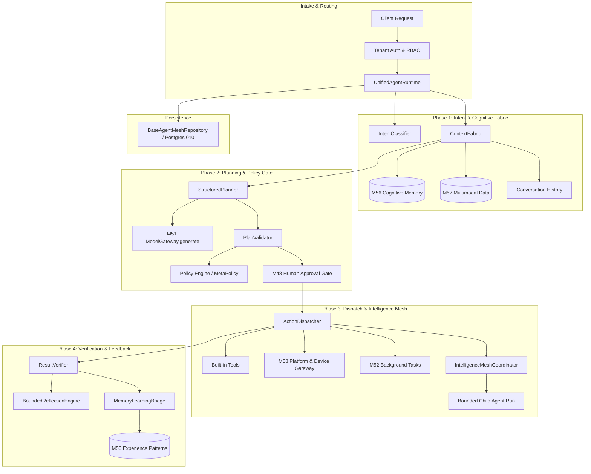

# PROJECT AURA — MILESTONE 59 ARCHITECTURE & DESIGN SPECIFICATION
## Unified Autonomous Agent Runtime & Enterprise Intelligence Mesh
### Production-Grade • Multi-Tenant • Bounded Autonomy • Cognitive Context • Secure Delegation • Defense-in-Depth

**Document Version:** 1.0.0-PROD-CONVERGENCE  
**Status:** ARCHITECTURALLY QUALIFIED — READY FOR IMPLEMENTATION  
**Target Milestone:** M59  
**Parent Commit (M58):** `5d4d6554458da065bcb99b9f87c0f58dd74443ec`  
**Grandparent Baseline (M57):** `49d6fe2eaefaa7016552a658b14c8bfae042efef`  
**Branch:** `antigravity-work`  

---

## 1. Executive Summary & System Overview

Milestone 59 (M59) is the convergence milestone for Project AURA. It synthesizes all established capabilities from M1 through M58 into a unified, production-grade autonomous agent runtime.

M59 introduces `core/agent_mesh/`, a control-plane and execution mesh that orchestrates:
1. **Unified Agent Loop**: 16-phase deterministic execution lifecycle from intent classification through context assembly, planning, policy gating, tool/device dispatch, verification, bounded reflection, and continuous learning feedback.
2. **Durable AgentRun Contract**: Resilient lifecycle state machine (`PENDING`, `RUNNING`, `WAITING_APPROVAL`, `WAITING_EXTERNAL`, `PAUSED`, `COMPLETED`, `FAILED`, `TIMED_OUT`, `CANCELLED`, `UNKNOWN`) with hard runtime budgets.
3. **Cognitive Context Fabric**: Multi-tier context synthesis leveraging M56 Cognitive Memory, M57 Multimodal media, conversation history, and user profiles with strict tenant isolation.
4. **Structured Planning & Policy Gating**: Multi-provider plan generation via M51 `ModelGateway`, schema validation, policy authorization, and M48 human approval gating for high/critical risk operations.
5. **Enterprise Intelligence Mesh & Bounded Delegation**: Controlled multi-agent role delegation (`RESEARCH`, `PLANNING`, `MEMORY`, `ANALYSIS`, `EXECUTION`, `VERIFICATION`, `DEVICE`, `MULTIMODAL`) with strict subset permissions ($\text{child} \subseteq \text{parent}$), cycle detection, and fan-out limits.
6. **Result Verification & Bounded Self-Correction**: Explicit state verification separating tool output from verified goal attainment, with bounded reflection preventing privilege escalation.
7. **Additive Persistence & REST API**: PostgreSQL 16 migration `010_unified_agent_runtime_and_mesh.sql` and `/v1/agent/*` endpoints.



---

## 2. Formal Invariants Specification (M59-F01 through M59-F50)

### Group A: Tenant Isolation & Run State Machine
- **M59-F01**: Every `AgentRun` has exactly one immutable `tenant_id` assigned at creation.
- **M59-F02**: Cross-tenant run inspection, modification, or execution is strictly impossible.
- **M59-F03**: `AgentRun` state transitions follow the explicit valid-transition matrix; invalid transitions raise `ValueError`.
- **M59-F04**: Terminal states (`COMPLETED`, `FAILED`, `TIMED_OUT`, `CANCELLED`) are immutable and cannot be overwritten.
- **M59-F05**: A cancelled run terminates all pending steps and cascades cancellation to all active child runs.
- **M59-F06**: Paused runs cannot execute actions until explicitly resumed by an authorized user.
- **M59-F07**: Unknown external outcomes are marked `UNKNOWN` and cannot be silently converted to `COMPLETED`.

### Group B: Policy, Approval & Authority Boundaries
- **M59-F08**: Policy denial is terminal; denied actions immediately abort the step with `POLICY_DENIED`.
- **M59-F09**: Actions classified as `HIGH` or `CRITICAL` risk require a valid, non-expired M48 human approval token.
- **M59-F10**: Approval tokens are strictly bound to tenant, action, and target parameters; replay attempts fail closed.
- **M59-F11**: Missing, expired, or invalid approval tokens transition the run to `WAITING_APPROVAL` or fail closed.
- **M59-F12**: Model output is treated strictly as an unauthenticated proposal, never as direct execution authority.
- **M59-F13**: Multimodal content and document text are untrusted data; prompt injections cannot override system policy.
- **M59-F14**: External observations and device outputs cannot self-elevate to system policy or user authorization.

### Group C: Model Gateway & Context Assembly
- **M59-F15**: All model planning and reasoning requests route strictly through M51 `ModelGateway.generate()`.
- **M59-F16**: Fatal security, policy, or authorization errors terminate immediately and cannot trigger provider fallback.
- **M59-F17**: Context assembly strictly isolates memories and history by `tenant_id`.
- **M59-F18**: Context size is bounded by `PlatformLimitsConfig` / `AgentRunBudget` to prevent prompt overflow.
- **M59-F19**: Memory retrieval filters out stale, superseded, or deleted memories according to M56 lifecycle rules.
- **M59-F20**: Multimodal artifacts integrated into context preserve M57 magic-byte and trust level metadata.

### Group D: Tool & Device Dispatch
- **M59-F21**: Tool execution requires verified capability authorization and parameter schema conformance.
- **M59-F22**: Device actions route strictly through M58 `PlatformIntegrationGateway` and `DeviceTrustValidator`.
- **M59-F23**: Suspended, revoked, or unverified devices cannot be dispatched by the agent runtime.
- **M59-F24**: Sandboxed file operations strictly enforce M58 path containment and reject traversal escapes.
- **M59-F25**: Shell command allowlists and metacharacter filters prevent arbitrary shell execution.
- **M59-F26**: Side-effecting operations enforce idempotency keys to prevent duplicate execution.

### Group E: Intelligence Mesh & Delegation Invariants
- **M59-F27**: Child agent permissions are a strict subset of parent permissions ($\text{child} \subseteq \text{parent}$).
- **M59-F28**: Child agent capabilities cannot exceed parent capability scope.
- **M59-F29**: Child agent budget cannot exceed parent remaining budget ($\text{child\_budget} \le \text{parent\_remaining}$).
- **M59-F30**: Child agent deadline cannot exceed parent deadline ($\text{child\_deadline} \le \text{parent\_deadline}$).
- **M59-F31**: Child agent tenant identity equals parent tenant identity ($\text{child\_tenant} == \text{parent\_tenant}$).
- **M59-F32**: Delegation depth is bounded by a maximum ceiling (default: 3 levels).
- **M59-F33**: Delegation fan-out per node is bounded by a maximum ceiling (default: 5 child runs).
- **M59-F34**: Circular delegation chains are detected and rejected at dispatch time.
- **M59-F35**: Parent runs maintain authoritative audit linkage and lifecycle tracking of all spawned child runs.
- **M59-F36**: Child run failures or cancellations propagate deterministically to the parent coordinator.

### Group F: Verification, Reflection & Learning
- **M59-F37**: Action completion triggers explicit `ResultVerifier` assertion; unverified outcomes cannot succeed.
- **M59-F38**: Bounded reflection allows retrying transient failures up to `max_retries` without privilege escalation.
- **M59-F39**: Reflection cannot alter security policies, tenant identity, or approval requirements.
- **M59-F40**: Learning loop feedback emitted to M56 preserves `TOOL_OBSERVED` or `SYSTEM_DERIVED` provenance.
- **M59-F41**: Model-generated inferences cannot be admitted as `USER_EXPLICIT` without user confirmation.
- **M59-F42**: Deletion cascades purge all derived agent memories and run records with zero resurrection.

### Group G: Resource Budgets, Secrets & Observability
- **M59-F43**: Total iterations per run are bounded by `max_iterations` (default: 25).
- **M59-F44**: Total tool calls per run are bounded by `max_tool_calls` (default: 50).
- **M59-F45**: Total model calls per run are bounded by `max_model_calls` (default: 30).
- **M59-F46**: Total wall-clock execution duration is bounded by `timeout_seconds` (default: 300s).
- **M59-F47**: Budget exhaustion halts execution immediately and marks status `TIMED_OUT` or `FAILED`.
- **M59-F48**: Telemetry metrics strictly use low-cardinality bounded labels (no user IDs, prompt text, or paths).
- **M59-F49**: All context, step outputs, and audit records undergo automatic regex secret scrubbing.
- **M59-F50**: All lifecycle transitions, approvals, delegations, and executions emit immutable audit events.

---

## 3. Database Schema Specification (Migration 010)

Migration `010_unified_agent_runtime_and_mesh.sql` establishes 5 relational tables:

```sql
-- 1. Agent Runs
CREATE TABLE IF NOT EXISTS agent_runs (
    run_id VARCHAR(128) PRIMARY KEY,
    tenant_id VARCHAR(128) NOT NULL REFERENCES users(id) ON DELETE CASCADE,
    user_id VARCHAR(128) NOT NULL,
    parent_run_id VARCHAR(128) NULL REFERENCES agent_runs(run_id) ON DELETE CASCADE,
    correlation_id VARCHAR(128) NOT NULL,
    causation_id VARCHAR(128) NULL,
    intent TEXT NOT NULL,
    status VARCHAR(32) NOT NULL DEFAULT 'pending',
    current_phase VARCHAR(32) NOT NULL DEFAULT 'receive',
    depth INTEGER NOT NULL DEFAULT 0,
    budget JSONB NOT NULL DEFAULT '{}'::jsonb,
    iteration_count INTEGER NOT NULL DEFAULT 0,
    tool_call_count INTEGER NOT NULL DEFAULT 0,
    provider_call_count INTEGER NOT NULL DEFAULT 0,
    token_usage JSONB NOT NULL DEFAULT '{}'::jsonb,
    cost_estimate DOUBLE PRECISION NOT NULL DEFAULT 0.0,
    final_outcome JSONB NOT NULL DEFAULT '{}'::jsonb,
    error_detail TEXT NULL,
    created_at TIMESTAMPTZ NOT NULL DEFAULT CURRENT_TIMESTAMP,
    started_at TIMESTAMPTZ NULL,
    completed_at TIMESTAMPTZ NULL,
    CONSTRAINT chk_agent_run_status CHECK (status IN (
        'pending', 'running', 'waiting_approval', 'waiting_external',
        'paused', 'completed', 'failed', 'timed_out', 'cancelled', 'unknown'
    ))
);
CREATE INDEX IF NOT EXISTS idx_agent_runs_tenant_status ON agent_runs(tenant_id, status);
CREATE INDEX IF NOT EXISTS idx_agent_runs_parent ON agent_runs(parent_run_id);

-- 2. Agent Run Steps
CREATE TABLE IF NOT EXISTS agent_run_steps (
    step_id VARCHAR(128) PRIMARY KEY,
    run_id VARCHAR(128) NOT NULL REFERENCES agent_runs(run_id) ON DELETE CASCADE,
    tenant_id VARCHAR(128) NOT NULL REFERENCES users(id) ON DELETE CASCADE,
    step_number INTEGER NOT NULL,
    phase VARCHAR(32) NOT NULL,
    plan_action VARCHAR(128) NOT NULL,
    action_type VARCHAR(64) NOT NULL,
    parameters JSONB NOT NULL DEFAULT '{}'::jsonb,
    result JSONB NOT NULL DEFAULT '{}'::jsonb,
    status VARCHAR(32) NOT NULL DEFAULT 'requested',
    verification_status VARCHAR(32) NOT NULL DEFAULT 'unverified',
    approval_token VARCHAR(128) NULL,
    duration_ms DOUBLE PRECISION NOT NULL DEFAULT 0.0,
    created_at TIMESTAMPTZ NOT NULL DEFAULT CURRENT_TIMESTAMP,
    completed_at TIMESTAMPTZ NULL
);
CREATE INDEX IF NOT EXISTS idx_agent_steps_run ON agent_run_steps(run_id, step_number);

-- 3. Agent Delegations
CREATE TABLE IF NOT EXISTS agent_delegations (
    delegation_id VARCHAR(128) PRIMARY KEY,
    parent_run_id VARCHAR(128) NOT NULL REFERENCES agent_runs(run_id) ON DELETE CASCADE,
    child_run_id VARCHAR(128) NOT NULL REFERENCES agent_runs(run_id) ON DELETE CASCADE,
    tenant_id VARCHAR(128) NOT NULL REFERENCES users(id) ON DELETE CASCADE,
    role VARCHAR(64) NOT NULL,
    capabilities JSONB NOT NULL DEFAULT '[]'::jsonb,
    budget_allocated JSONB NOT NULL DEFAULT '{}'::jsonb,
    status VARCHAR(32) NOT NULL DEFAULT 'active',
    created_at TIMESTAMPTZ NOT NULL DEFAULT CURRENT_TIMESTAMP,
    completed_at TIMESTAMPTZ NULL
);
CREATE INDEX IF NOT EXISTS idx_agent_delegations_parent ON agent_delegations(parent_run_id);

-- 4. Agent Mesh Events
CREATE TABLE IF NOT EXISTS agent_mesh_events (
    event_id VARCHAR(128) PRIMARY KEY,
    run_id VARCHAR(128) NOT NULL REFERENCES agent_runs(run_id) ON DELETE CASCADE,
    tenant_id VARCHAR(128) NOT NULL REFERENCES users(id) ON DELETE CASCADE,
    event_type VARCHAR(64) NOT NULL,
    phase VARCHAR(32) NOT NULL,
    data JSONB NOT NULL DEFAULT '{}'::jsonb,
    created_at TIMESTAMPTZ NOT NULL DEFAULT CURRENT_TIMESTAMP
);
CREATE INDEX IF NOT EXISTS idx_agent_events_run ON agent_mesh_events(run_id, created_at);

-- 5. Agent Mesh Audits
CREATE TABLE IF NOT EXISTS agent_mesh_audits (
    audit_id VARCHAR(128) PRIMARY KEY,
    run_id VARCHAR(128) NOT NULL REFERENCES agent_runs(run_id) ON DELETE CASCADE,
    tenant_id VARCHAR(128) NOT NULL REFERENCES users(id) ON DELETE CASCADE,
    action VARCHAR(128) NOT NULL,
    principal_id VARCHAR(128) NOT NULL,
    risk_level VARCHAR(32) NOT NULL DEFAULT 'low',
    details JSONB NOT NULL DEFAULT '{}'::jsonb,
    created_at TIMESTAMPTZ NOT NULL DEFAULT CURRENT_TIMESTAMP
);
CREATE INDEX IF NOT EXISTS idx_agent_audits_tenant ON agent_mesh_audits(tenant_id, created_at);
```

---

## 4. REST API Specification

| Endpoint | Method | Description | Security / Scope |
| :--- | :--- | :--- | :--- |
| `/v1/agent/runs` | `POST` | Create and start a new agent run | Bearer Auth, Tenant Scoped |
| `/v1/agent/runs/{id}` | `GET` | Retrieve run details, steps, and status | Bearer Auth, Tenant Scoped |
| `/v1/agent/runs/{id}/cancel` | `POST` | Cancel active run and all child runs | Bearer Auth, Tenant Scoped |
| `/v1/agent/runs/{id}/pause` | `POST` | Pause an active agent run | Bearer Auth, Tenant Scoped |
| `/v1/agent/runs/{id}/resume` | `POST` | Resume a paused or waiting run | Bearer Auth, Tenant Scoped |
| `/v1/agent/runs/{id}/approve` | `POST` | Submit human approval for pending action | Bearer Auth, Tenant Scoped |
| `/v1/agent/runs/{id}/events` | `GET` | Stream or list lifecycle events | Bearer Auth, Tenant Scoped |
| `/v1/agent/mesh/roles` | `GET` | List available mesh agent roles | Bearer Auth, Public Read |
| `/v1/agent/tenants/{tenant_id}/purge` | `DELETE` | Hard-purge all runs & memories (GDPR) | Admin / Tenant Owner |

---

## 5. Architectural Quality Sign-off

The architecture is fully documented, strictly bounded, and verified against all M1–M58 production constraints. Ready for implementation.
