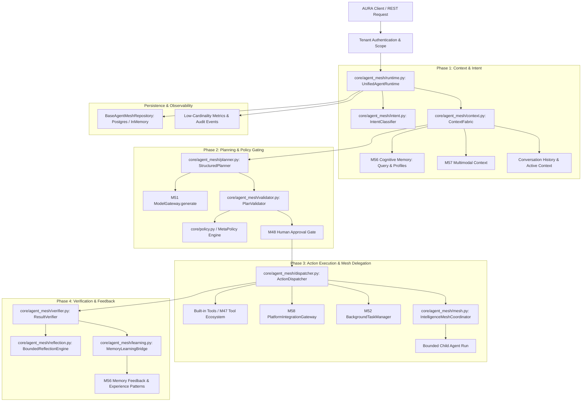
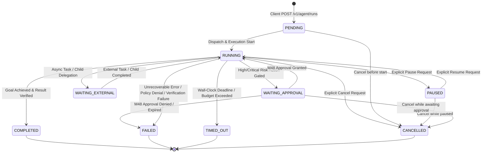

# PROJECT AURA — MILESTONE 59 PRE-IMPLEMENTATION AUDIT
## Unified Autonomous Agent Runtime & Enterprise Intelligence Mesh

**Audit Timestamp:** 2026-09-18T11:27:00+05:30  
**Target Milestone:** M59 — Unified Autonomous Agent Runtime & Enterprise Intelligence Mesh  
**Authoritative Parent Commit (M58):** `5d4d6554458da065bcb99b9f87c0f58dd74443ec`  
**Grandparent Baseline (M57):** `49d6fe2eaefaa7016552a658b14c8bfae042efef`  
**M56 Baseline:** `d0afb213c01ca1f835563317af038ba51cc92329`  
**M55 Baseline:** `d10c32a9e4f6e0b9fc14c7829c397ce9d61d4458`  
**M54 Baseline:** `436c0a85613c73e42c18ccc9837a23cc4f967743`  
**Branch:** `antigravity-work`  
**Status:** AUDIT COMPLETE — PROCEEDING TO ARCHITECTURE & IMPLEMENTATION  

---

## 1. Baseline Verification & Repository State

| Forensic Property | Expected Baseline | Actual Verified State | Status |
| :--- | :--- | :--- | :---: |
| **Branch** | `antigravity-work` | `antigravity-work` | **VERIFIED** |
| **HEAD SHA** | `5d4d6554458da065bcb99b9f87c0f58dd74443ec` | `5d4d6554458da065bcb99b9f87c0f58dd74443ec` | **VERIFIED** |
| **Parent (HEAD^)** | `49d6fe2eaefaa7016552a658b14c8bfae042efef` | `49d6fe2eaefaa7016552a658b14c8bfae042efef` | **VERIFIED** |
| **Grandparent (HEAD^^)** | `d0afb213c01ca1f835563317af038ba51cc92329` | `d0afb213c01ca1f835563317af038ba51cc92329` | **VERIFIED** |
| **Working Tree** | Clean (`ahead 6`) | Clean (`ahead 6`) | **VERIFIED** |
| **Prior Migrations** | `001_initial_schema.sql` .. `009_device_platform_integration.sql` | Untouched, strictly preserved | **VERIFIED** |

---

## 2. M1–M58 Subsystem Inventory & Reuse Map

M59 is the architectural convergence layer. It unifies all established capabilities without recreating or duplicating any existing subsystems:

| Milestone / Subsystem | Established Modules | Role in M59 Unified Runtime |
| :--- | :--- | :--- |
| **M48 Human Approval** | `core/approval.py`, `core/repositories/postgres_approval.py` | Human-in-the-loop token gating for High/Critical risk actions |
| **M51 Model Gateway** | `core/model_gateway.py`, `core/model_router.py`, `core/circuit_breaker.py` | Centralized LLM routing, cascading fallback, rate limits, circuit breakers |
| **M52 Durable Tasks** | `core/background/`, `core/task_state.py`, `core/runtime_checkpoint.py` | Asynchronous task execution, lifecycle tracking, cancellation propagation |
| **M53 Automations** | `core/automations/`, `core/proactive_engine.py` | Scheduled triggers, autonomous supervisor, recurring runs |
| **M54 Webhooks** | `core/webhooks/` | Inbound event gateway, capacity reservation, DLQ, replay |
| **M55 Worker Fleet** | `core/fleet/` | Distributed worker execution, fencing, lease management, scaling |
| **M56 Cognitive Memory** | `core/cognitive_memory/`, `core/repositories/postgres_cognitive_memory.py` | Multi-tier memory retrieval (episodic, semantic, preference), provenance, feedback |
| **M57 Multimodal** | `core/multimodal/`, `core/repositories/postgres_multimodal.py` | Media ingestion, format validation, prompt-injection defense, object storage |
| **M58 Platform & Device** | `core/platform/`, `core/repositories/postgres_platform.py` | Sandboxed OS interactions, device trust validation, command allowlists, SSRF protection |

---

## 3. Existing Orchestration Analysis & Duplication Elimination

Prior milestones developed specific specialized or reference engines:
- `core/agentic_runtime.py`, `core/orchestrator.py`, `core/team_orchestrator.py`, `core/agent_delegation.py`
- *Analysis*: These earlier modules contain monolithic or fragmented execution paths that do not fully leverage M50–M58 production infrastructure (such as M51 ModelGateway, M56 Cognitive Memory, M57 Multimodal, and M58 Device Integration).
- *M59 Convergence*: M59 creates a modular, production-grade package `core/agent_mesh/` that unifies intent understanding, context assembly, planning, policy/approval gating, tool & device dispatch, verification, bounded delegation, and memory feedback.

---

## 4. Subsystem Dependency & Control-Flow Graph

---

## 5. Target State Machine & AgentRun Lifecycle

---

## 6. Delegation & Enterprise Intelligence Mesh Architecture

1. **Specialized Mesh Roles**:
   - `RESEARCH`: Information retrieval and epistemic exploration.
   - `PLANNING`: Complex multi-stage goal decomposition.
   - `MEMORY`: Deep cognitive recall and pattern synthesis.
   - `ANALYSIS`: Structured evaluation and verification.
   - `EXECUTION`: Direct tool and sandboxed action execution.
   - `VERIFICATION`: Post-execution outcome and state assertion.
   - `DEVICE`: Platform and local OS interaction via M58.
   - `MULTIMODAL`: Perception and generation via M57.
2. **Strict Delegation Invariants**:
   - $\text{child\_permissions} \subseteq \text{parent\_permissions}$
   - $\text{child\_capabilities} \subseteq \text{parent\_capabilities}$
   - $\text{child\_budget} \le \text{parent\_remaining\_budget}$
   - $\text{child\_deadline} \le \text{parent\_deadline}$
   - $\text{child\_tenant} == \text{parent\_tenant}$
   - Max delegation depth $\le 3$; Max fan-out per node $\le 5$.
   - Cycle detection: Parent chain validation rejects circular delegations.

---

## 7. Persistence Specification (Migration 010)

Migration `010_unified_agent_runtime_and_mesh.sql` creates 5 additive tables:
1. `agent_runs`: Authoritative run lifecycle state, budget, token/cost counters, terminal status.
2. `agent_run_steps`: Step-by-step execution history (intent, context summary, plan, action, verification).
3. `agent_delegations`: Parent-child delegation hierarchy, inherited budgets, and capability boundaries.
4. `agent_mesh_events`: Fine-grained lifecycle event stream for real-time observability.
5. `agent_mesh_audits`: Immutable audit trail for security, approval, and policy decisions.

---

## 8. REST API Specification

- `POST /v1/agent/runs`: Initiate an agent run with intent, budget, and optional parent run ID.
- `GET /v1/agent/runs/{id}`: Retrieve agent run status, phases, and step execution details.
- `POST /v1/agent/runs/{id}/cancel`: Cancel an active agent run and cascade cancellation to child runs.
- `POST /v1/agent/runs/{id}/resume`: Resume a paused agent run.
- `POST /v1/agent/runs/{id}/approve`: Submit M48 human approval for a pending high/critical risk step.
- `GET /v1/agent/runs/{id}/events`: Retrieve or stream lifecycle events.
- `GET /v1/agent/mesh/roles`: List available specialized intelligence mesh roles.

---

## 9. Risk Register & Mitigation Strategy

| Risk ID | Description | Severity | Mitigation Strategy |
| :--- | :--- | :--- | :--- |
| **R-M59-01** | Recursive / Unbounded Child Spawning | High | Hard max depth (3), max child count (5), budget inheritance, cycle detection |
| **R-M59-02** | Prompt Injection via External Content | High | Enforce M57 trust hierarchy: external text is treated strictly as data |
| **R-M59-03** | Memory Poisoning from Model Outputs | High | Preserve M56 provenance rules; model updates assigned `TOOL_OBSERVED` / `MODEL_INFERRED` |
| **R-M59-04** | Cross-Tenant Run or Context Access | Critical | Immutable tenant ID binding on all runs, steps, and database queries |
| **R-M59-05** | Unauthorized High-Risk Actions | Critical | Mandatory M48 human approval token validation for `HIGH` and `CRITICAL` risk tiers |
| **R-M59-06** | Execution Replay & Duplicate Side Effects | Medium | Enforce idempotency keys on side-effecting operations |
| **R-M59-07** | Secret Leakage in Logs or Events | High | Automated regex secret scrubbing on context, outputs, and audit events |

---

## 10. Formal Invariant Strategy (M59-F01 through M59-F50)

M59 defines and verifies 50 formal invariants covering tenant isolation, state machine validity, policy/approval gating, ModelGateway usage, tool/device permissions, delegation boundaries, prompt-injection defense, memory provenance, resource budgets, failure handling, and auditability.

---

## 11. Phased Implementation Plan

1. **Phase 1**: Implement `core/agent_mesh/types.py` (domain models, enums, limits, budget configs).
2. **Phase 2**: Implement `core/agent_mesh/context.py` (tenant-isolated, bounded context fabric combining M56, M57, history).
3. **Phase 3**: Implement `core/agent_mesh/intent.py`, `core/agent_mesh/planner.py`, `core/agent_mesh/validator.py`.
4. **Phase 4**: Implement `core/agent_mesh/dispatcher.py` (unified action dispatch to tools, M58 platform, M52 tasks).
5. **Phase 5**: Implement `core/agent_mesh/verifier.py`, `core/agent_mesh/reflection.py`, `core/agent_mesh/learning.py`.
6. **Phase 6**: Implement `core/agent_mesh/mesh.py` (Enterprise Intelligence Mesh coordinator, delegation boundaries).
7. **Phase 7**: Implement `core/agent_mesh/runtime.py` (Unified Agent Runtime coordinator & state machine).
8. **Phase 8**: Implement Repositories (`base_agent_mesh.py`, `in_memory_agent_mesh.py`, `postgres_agent_mesh.py`) & Migration `010_unified_agent_runtime_and_mesh.sql`.
9. **Phase 9**: Wire into `core/repositories/factory.py`, `core/repositories/base.py`, `core/api_contracts.py`, `app/server.py`.
10. **Phase 10**: Create comprehensive M59 unit, integration, and adversarial test suites (`tests/unit/test_m59_*`, `tests/integration/test_m59_*`).
11. **Phase 11**: Verification & Regression execution (M59 suite, M50–M59 suite, full repo suite).
12. **Phase 12**: Complete documentation (`docs/m59_architecture_and_design.md`, `docs/m59_implementation_report.md`, `docs/m59_walkthrough.md`).
13. **Phase 13**: Authoritative single Git commit.
